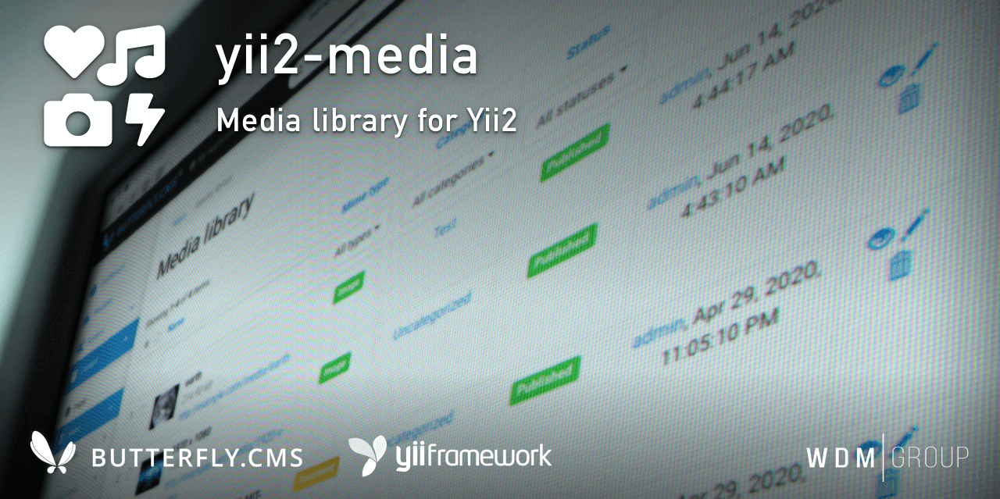

# Yii2 Media
Media library for Yii2 with media categories and drag'n'drop uploader.

This module is an integral part of the [Butterfly.СMS](https://butterflycms.com/) content management system, but can also be used as an standalone extension.

Copyrights (c) 2019-2021 [W.D.M.Group, Ukraine](https://wdmg.com.ua/)

# Requirements 
* PHP 5.6 or higher
* Yii2 v.2.0.40 and newest
* [Yii2 Base](https://github.com/wdmg/yii2-base) module (required)
* [Yii2 Imagine](https://github.com/yiisoft/yii2-imagine) extension (required)
* [Yii2 SelectInput](https://github.com/wdmg/yii2-selectinput) widget

# Installation
To install the module, run the following command in the console:

`$ composer require "wdmg/yii2-media"`

After configure db connection, run the following command in the console:

`$ php yii media/init`

And select the operation you want to perform:
  1) Apply all module migrations
  2) Revert all module migrations

# Migrations
In any case, you can execute the migration and create the initial data, run the following command in the console:

`$ php yii migrate --migrationPath=@vendor/wdmg/yii2-media/migrations`

# Configure
To add a module to the project, add the following data in your configuration file:

    'modules' => [
        ...
        'media' => [
            'class' => 'wdmg\media\Module',
            'routePrefix' => 'admin',
            'mediaRoute' => '/media', // Routes to render media item (use "/" - for root)
            'mediaCategoriesRoute' => '/media/categories', // Routes to render media categories (use "/" - for root)
            'mediaPath' => '/uploads/media', // Path to save media files in @webroot
            'mediaThumbsPath' => '/uploads/media/_thumbs', // Path to save media thumbnails in @webroot
            'maxFilesToUpload' => 10, // maximum files to upload
            'maxUploadSize' => 5242880, // max file size in bytes to upload
            'allowedMime' => [ // allowed mime types
                'image/png' => true,
                'image/jpeg' => true,
                'image/gif' => true,
                'image/svg+xml' => true,
                'application/pdf' => true,
                'application/msword' => true,
                'application/vnd.ms-excel' => true,
                'application/rtf' => true,
                'text/csv' => true,
                'text/plain' => true,
                ...
            ]
        ],
        ...
    ],

# Routing
Use the `Module::dashboardNavItems()` method of the module to generate a navigation items list for NavBar, like this:

    <?php
        echo Nav::widget([
        'options' => ['class' => 'navbar-nav navbar-right'],
            'label' => 'Modules',
            'items' => [
                Yii::$app->getModule('media')->dashboardNavItems(),
                ...
            ]
        ]);
    ?>

# Status and version [ready to use]
* v.1.0.6 - RBAC implementation, read EXIF
* v.1.0.5 - Update README.md
* v.1.0.4 - Added drag-n-drop for upload
* v.1.0.3 - Log activity
* v.1.0.2 - Added pagination, up to date dependencies
* v.1.0.1 - Check file not exists or generate unique filename
* v.1.0.0 - CRUD for media items/categories, translations
* v.0.0.3 - Upload functionality, mime types validator and preview thumbnails
